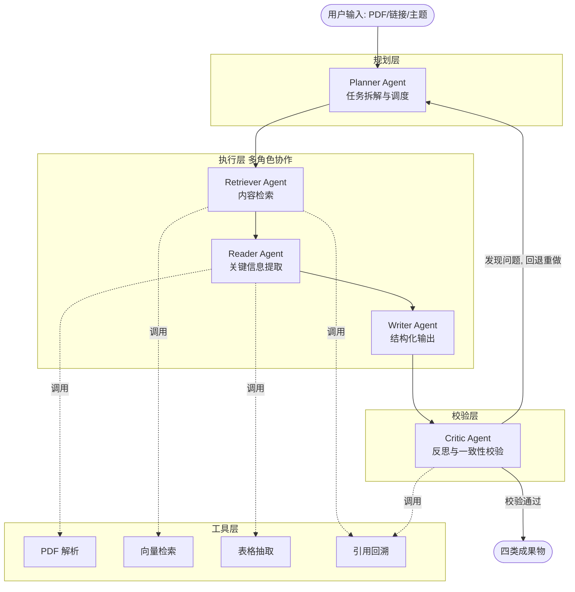
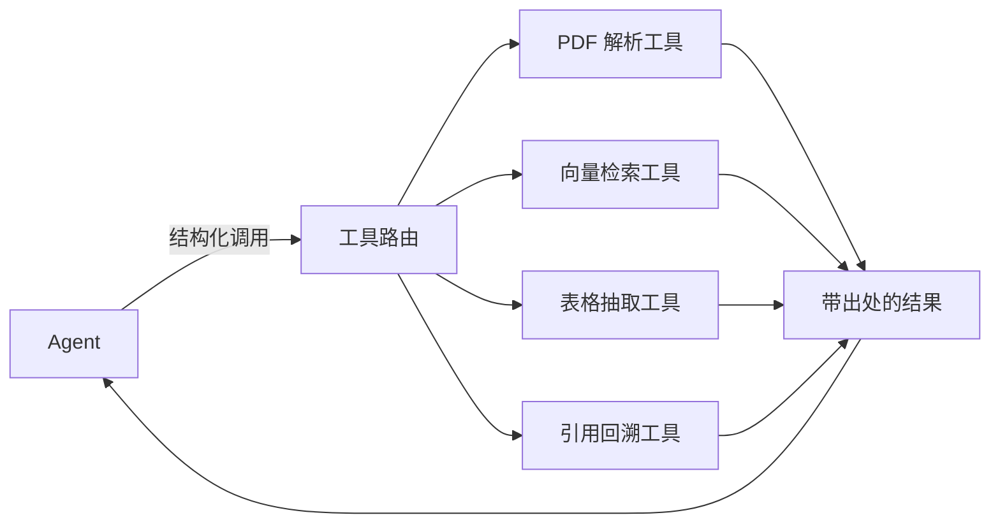

# 多 Agent 论文阅读与综述生成系统 —— 项目计划书

> 版本: v1.0  
> 编写日期: 2026-06-01  
> 技术栈: Python + LangGraph / LangChain + 国产大模型 API  
> 运行环境: Windows

---

## 1. 项目概述

本项目基于 **Planner-Executor(规划-执行)** 架构构建一个多 Agent 协作的论文阅读与综述生成系统。系统将"读懂一篇/一批论文并产出结构化成果"这一复杂任务,自动拆解为**文献解析、核心方法抽取、实验结果整理、创新点总结、一致性校验**等子任务,由多个具备不同职责的 Agent 协同完成。

通过引入**工具调用(Tool Calling)机制**(PDF 解析、向量检索、表格抽取、引用片段回溯),将大模型的"自由生成"约束到"有证据支撑的生成",从而显著降低幻觉风险,保证每一条结论都可回溯到原文。

### 1.1 核心目标

- 输入: 一篇或多篇论文(PDF / arXiv 链接 / 本地文件)
- 输出(四类成果物):
  1. **论文精读笔记**(Reading Notes)
  2. **Related Work 草稿**(可直接用于论文写作)
  3. **审稿意见初稿**(Review Draft)
  4. **方法对比表**(Comparison Table)

### 1.2 适用场景

- 科研人员快速精读 / 批量调研文献
- 论文写作时自动生成 Related Work 初稿
- 模拟审稿,提前发现论文薄弱点
- 多篇同主题论文的横向方法对比

---

## 2. 系统架构

### 2.1 总体架构(Planner-Executor)

采用"中央规划 + 多角色执行 + 反思校验"的闭环架构。Planner 负责任务拆解与调度,Executor 层由 4 个专职 Agent 构成,Critic 负责反思校验形成回环。



### 2.2 任务拆解(子任务)

Planner 将总任务拆解为以下子任务并编排执行顺序:

- **文献解析**: PDF → 结构化章节/段落/图表
- **核心方法抽取**: 提取问题定义、方法框架、关键公式与模块
- **实验结果整理**: 抽取实验设置、数据集、指标与对比结果
- **创新点总结**: 归纳贡献点与相对已有工作的差异
- **一致性校验**: 校验生成内容与原文是否一致、引用是否真实

---

## 3. Agent 角色设计

| Agent | 职责 | 主要输入 | 主要输出 | 依赖工具 |
| --- | --- | --- | --- | --- |
| **Planner** | 任务拆解、子任务调度、决定是否回退重做 | 用户请求 | 任务计划(DAG/步骤序列) | 无 |
| **Retriever** | 从论文库/向量库中检索相关片段,定位证据 | 子任务 query | 相关文本块 + 出处定位 | 向量检索、引用回溯 |
| **Reader** | 精读片段,抽取方法/实验/创新点等结构化信息 | 检索片段 | 结构化字段(JSON) | PDF 解析、表格抽取 |
| **Critic** | 反思校验生成结果,核对引用真实性与一致性 | Reader/Writer 输出 | 校验报告 + 修订建议 | 引用回溯 |
| **Writer** | 将结构化信息组织成四类成果物 | 结构化信息 | 笔记/RelatedWork/审稿/对比表 | 无 |

> 设计要点:Reader 只输出**带证据引用**的结构化字段;Writer 只允许基于 Reader 已验证的字段写作;Critic 对每条结论回溯原文,不通过则触发回退。

---

## 4. 工具调用机制(降低幻觉的核心)

所有事实性内容必须经过工具获取或被工具验证,Agent 不得"凭空生成"事实。



| 工具 | 功能 | 候选实现 |
| --- | --- | --- |
| **PDF 解析** | PDF → 文本/章节/标题/图表区域 | PyMuPDF(fitz) / pdfplumber / unstructured |
| **向量检索** | 文本分块 + Embedding + 语义检索 | Chroma / FAISS + 国产 Embedding API |
| **表格抽取** | 提取实验结果表为结构化数据 | pdfplumber / camelot |
| **引用回溯** | 将每条结论映射回原文页码/段落,生成可追溯片段 | 自研片段索引(chunk_id → page/span) |

**防幻觉策略**:
- 每个抽取字段强制携带 `source`(chunk_id + 页码/位置)
- Critic 对引用做"回查"——若片段不存在或语义不符则判定为幻觉并打回
- Writer 输出中保留引用标记,便于人工核对

---

## 5. 技术选型

| 维度 | 选型 | 说明 |
| --- | --- | --- |
| 语言 | Python 3.10+ | 生态成熟 |
| 编排框架 | LangGraph(图编排)+ LangChain(工具/LLM 封装) | 天然适配 Planner-Executor 与回退环路 |
| 大模型 | **DeepSeek `deepseek-chat`**(OpenAI 兼容接口) | 默认模型,通过可切换的 LLM Provider 适配层封装 |
| Embedding | DeepSeek / 兼容 Embedding API | 与 LLM 同源,降低接入成本 |
| 向量库 | Chroma(本地优先,零运维) | 可后续替换 FAISS/Milvus |
| PDF 解析 | PyMuPDF + pdfplumber | 文本与表格互补 |
| 配置 | `.env` + pydantic-settings | API Key/模型名集中管理 |
| 接口 | CLI 优先,预留 FastAPI Web 接口 | 先跑通,后扩展 |

> 模型接入采用**适配层**(`llm_provider`),默认使用 DeepSeek 的 `deepseek-chat`(OpenAI 兼容协议),Key 通过 `.env` 注入,不写死在代码中;后续可一键切换其它厂商。

### 5.1 LLM 配置与 API 密钥预留

全局配置集中在 `config/settings.py`(基于 pydantic-settings),关键字段如下,密钥统一从 `.env` 读取,**严禁硬编码**:

```python
# config/settings.py (规划示意)
class Settings(BaseSettings):
    # === DeepSeek 大模型配置 ===
    llm_api_key: str = ""                                   # 在 .env 中填写 DEEPSEEK_API_KEY
    llm_base_url: str = "https://api.deepseek.com/v1"       # DeepSeek OpenAI 兼容端点
    llm_model: str = "deepseek-chat"                        # 默认模型
    llm_temperature: float = 0.2

    # === Embedding 配置 ===
    embedding_api_key: str = ""                             # 可复用同一密钥
    embedding_base_url: str = "https://api.deepseek.com/v1"
    embedding_model: str = "embedding-2"

    class Config:
        env_file = ".env"
        env_file_encoding = "utf-8"
```

对应的 `.env.example` 模板(用户复制为 `.env` 后在此填写自己的密钥):

```bash
# === DeepSeek API 配置(请在此处填写你的密钥)===
DEEPSEEK_API_KEY=请在这里填写你的_DeepSeek_API_Key
LLM_BASE_URL=https://api.deepseek.com/v1
LLM_MODEL=deepseek-chat
LLM_TEMPERATURE=0.2

# === Embedding 配置(可复用上面的密钥)===
EMBEDDING_API_KEY=请在这里填写你的_Embedding_API_Key
EMBEDDING_BASE_URL=https://api.deepseek.com/v1
EMBEDDING_MODEL=embedding-2
```

> DeepSeek 提供 OpenAI 兼容接口,因此 LLM 适配层可直接复用 `langchain-openai` 的 `ChatOpenAI`,仅需将 `base_url`、`api_key`、`model` 指向 DeepSeek 即可。

---

## 6. 目录结构(规划)

```
MultiAgent/
├── README.md
├── 项目计划书.md
├── requirements.txt
├── .env.example                 # API Key/模型配置模板
├── config/
│   └── settings.py              # 全局配置(pydantic-settings)
├── src/
│   ├── main.py                  # CLI 入口
│   ├── graph/
│   │   ├── workflow.py          # LangGraph 图: Planner-Executor-Critic 环路
│   │   └── state.py             # 全局状态(共享上下文/中间结果)
│   ├── agents/
│   │   ├── planner.py           # Planner Agent
│   │   ├── retriever.py         # Retriever Agent
│   │   ├── reader.py            # Reader Agent
│   │   ├── critic.py            # Critic Agent
│   │   └── writer.py            # Writer Agent
│   ├── tools/
│   │   ├── pdf_parser.py        # PDF 解析
│   │   ├── vector_store.py      # 向量检索(分块/Embedding/检索)
│   │   ├── table_extractor.py   # 表格抽取
│   │   └── citation.py          # 引用片段回溯
│   ├── llm/
│   │   └── provider.py          # 国产大模型适配层(可切换)
│   ├── schemas/
│   │   └── models.py            # 结构化数据模型(方法/实验/创新点等)
│   └── prompts/
│       └── *.py                 # 各 Agent 提示词模板(中文)
├── data/
│   ├── papers/                  # 输入 PDF
│   └── vector_db/               # 向量库持久化
└── outputs/                     # 四类成果物输出
    ├── notes/
    ├── related_work/
    ├── reviews/
    └── comparison_tables/
```

---

## 7. 数据流与状态

LangGraph 维护一份全局 `State`(贯穿各节点的共享上下文),关键字段:

- `paper_meta`: 论文元信息(标题/作者/来源)
- `chunks`: 分块后的文本及其定位信息(chunk_id → page/span)
- `extracted`: Reader 抽取的结构化信息(每项带 source)
- `critique`: Critic 校验报告与修订建议
- `retry_count`: 回退次数(超过阈值则带提示退出,避免死循环)
- `outputs`: 四类成果物

执行环路:`Planner → Retriever → Reader → Writer → Critic → (通过则输出 / 不通过则回 Planner)`,设置最大重试次数防止无限回环。

---

## 8. 成果物规格

| 成果物 | 内容要点 | 格式 |
| --- | --- | --- |
| 论文精读笔记 | 问题、方法、实验、创新点、个人评注,每条带原文引用 | Markdown |
| Related Work 草稿 | 按主题/方法归类的相关工作段落,含引用占位 | Markdown |
| 审稿意见初稿 | 总体评价、优点、缺点、可改进项、给作者的问题 | Markdown |
| 方法对比表 | 多论文 × 方法/数据集/指标/优缺点维度对比 | Markdown 表格 / CSV |

---

## 9. 里程碑计划


- **里程碑 1 — 工程骨架与工具层**: 搭建目录、配置、LLM 适配层;实现 PDF 解析 + 向量检索 + 引用回溯工具,可独立测试。
- **里程碑 2 — 单论文精读链路**: 打通 Planner→Retriever→Reader,产出带引用的结构化精读笔记。
- **里程碑 3 — Critic 校验环路**: 引入 Critic 与回退机制,验证防幻觉效果。
- **里程碑 4 — Writer 多成果物**: 输出 Related Work 草稿、审稿意见、对比表。
- **里程碑 5 — 多论文与优化**: 支持批量论文横向对比,完善鲁棒性、日志与 README。

---

## 10. 风险与对策

| 风险 | 影响 | 对策 |
| --- | --- | --- |
| 大模型幻觉 | 结论不可信 | 强制证据引用 + Critic 回溯校验 |
| PDF 解析质量参差(双栏/公式/图表) | 抽取错误 | PyMuPDF + pdfplumber 互补,失败降级处理 |
| 校验环路无限循环 | 卡死/费用高 | `retry_count` 上限 + 带说明退出 |
| API Key 泄露 | 安全风险 | `.env` 管理,`.env.example` 仅作模板 |
| 国产模型接口差异 | 迁移成本 | LLM 适配层统一封装,配置切换 |
| 中文乱码 | 输出不可读 | 全流程 UTF-8,文件读写显式指定编码 |

---

## 11. 后续可扩展方向

- FastAPI + 前端可视化(论文上传、成果物在线查看与引用高亮)
- 支持 arXiv / 语义学者(Semantic Scholar)在线检索拉取
- 引入更细的 Critic 评分维度与自动评测
- 多语言论文支持与中英双语成果物

---

> 备注:本计划书为 v1.0 初版,确认后将按里程碑 1 开始落地。所有代码注释使用中文并采用 UTF-8 编码。
